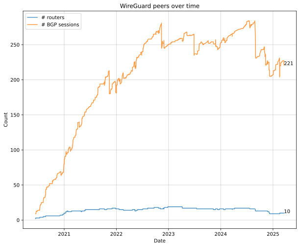

# ansible-dn42

This repository contains the configs for AS4242421080 / JLU5-AS on [dn42](https://dn42.net/Home). For peering details, see https://jlu5.com/dn42

## Network topology

This iteration of the network uses the Babel IGP and a partial mesh of iBGP routers + route reflectors. Internal costs between nodes are [automatically generated](scripts/igpping/) based off latency and packet loss.

[Routing Policy](ROUTING-POLICY.md)

## Config structure

Here I use Ansible to configure the following components:

- Wireguard ([roles/config-wireguard/](roles/config-wireguard/)) via ifupdown (i.e. `/etc/network/interfaces.d`)
- BIRD 2 ([roles/config-bird2/](roles/config-bird2/))
- [BIRD Looking Glass](https://github.com/sesa-me/bird-lg)
- [dn42 Peerfinder](https://dn42.us/peers)
- Anycast DNS via PowerDNS:
  - Authoritative server for jlu5.dn42 and PTR zones
  - Public recursive resolver (dn42, clearnet, and interconnected networks) @ **dns.jlu5.dn42** / 172.23.0.53 / fd42:d42:d42:53::1
  - For this I also use a [custom DNS zone generator](scripts/make-dns-zones.py) that reads from [YAML](global-config/dns-entries.yml) and the Ansible inventory
- iptables firewall rules for dn42

## Network history

